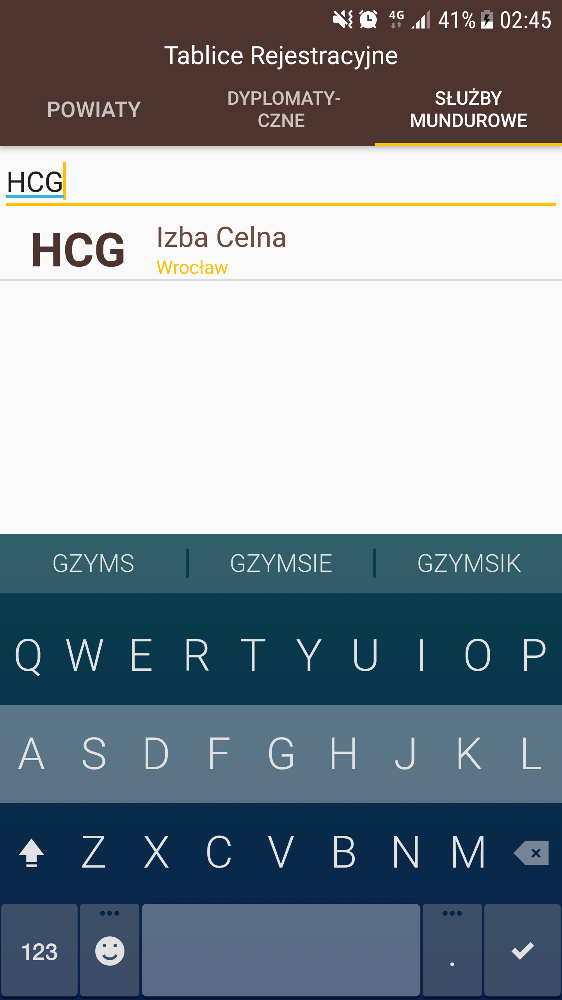
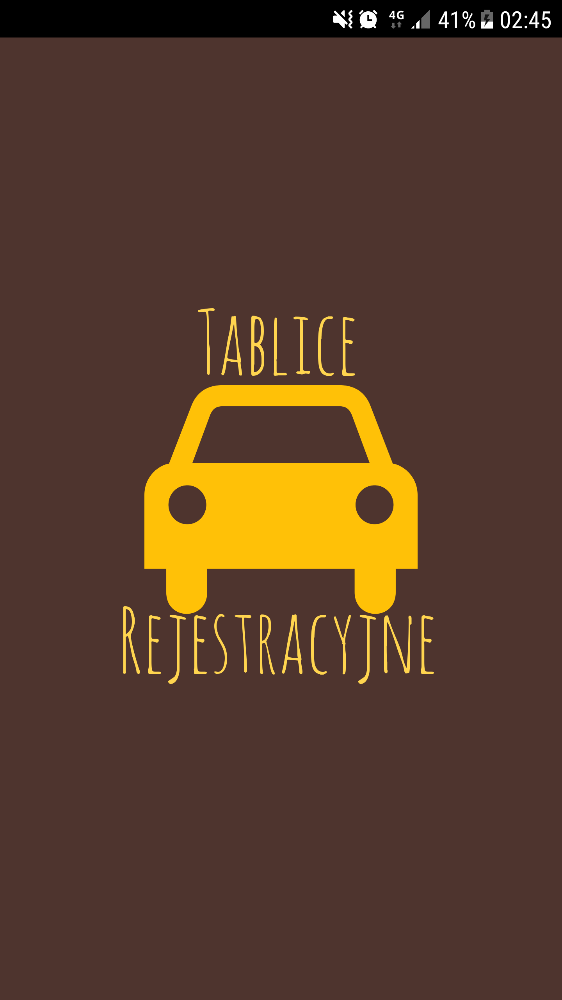
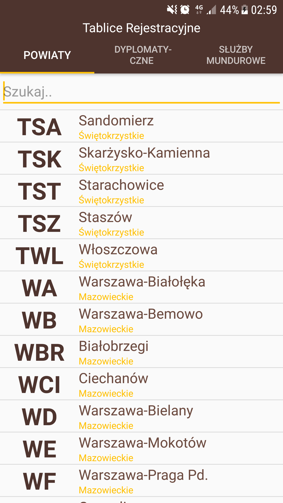

[PL] Tablice Rejestracyjne
=======================
*<i>Prosta, lekka, przejrzysta aplikacja do szukania polskich tablic rejestracyjnych </i>*


Niezwykle przyjazny i czytelny interfejs, za pomocą filtru umożliwi Ci wyszukanie tablicy rejestracyjnej jakiej szukasz.
Dostępna offline w każdym miejscu, bez jakichkolwiek reklam.

Kategorie Tablic Rejestracyjnych:
- Powiaty
    - Wyróżnik
    - Miasto
    - Województwo
- Dyplomatyczne
    - Wyróżnik numeczyny
    - Kraj
- Służby cywilne
    - Wyróżnik
    - Służba mundorowa
    - Województwo / Miasto (opcjonalnie)
    
Zrzuty ekranu
------



Korzystanie
------
- Za pomocą palca, w płynny sposób przewijaj kategorię w której szukasz tablicy.

- Wykorzystaj filtr, aby zewęzić listę tablic.

- Kliknij w tablicę aby dodatkowo został wyświetlony jej wyróżnik


Nabliższe ulepszenia
------
- Przytrzymaj tablicę, aby skopiować wyróżnik do schowka.
- Filtrowanie za pomocą wszystkich kolumn.
- Zastąpienie obecnej bazy, bazą zewnętrzną.


Przykładowy kod
------------
```java
    private static final String TABLE_PROVINCE_CREATE() {
        StringBuilder sb = new StringBuilder();
        sb.append("CREATE TABLE IF NOT EXISTS ").append(TABLE_PROVINCE).append(" ( ")
                .append(KEY_ROWID).append(" INTEGER PRIMARY KEY autoincrement,")
                .append(KEY_SHORTCUT).append(",")
                .append(KEY_CITY).append(" ,")
                .append(KEY_PROVINCE).append(" );");

        return sb.toString();
    }
```

```java
        final SimpleCursorAdapter tabliceAdapter = new SimpleCursorAdapter(getContext(), R.layout.tablica_uniformed, cursor, columns, rows, 0);

        final ListView listView = (ListView) rootView.findViewById(R.id.tabliceListView);
        listView.setAdapter(tabliceAdapter);

        listView.setOnItemClickListener(new AdapterView.OnItemClickListener() {
            @Override
            public void onItemClick(AdapterView<?> parent, View view, int position, long id) {
                Cursor cursor = (Cursor) listView.getItemAtPosition(position);
                String tablicaShortcut = cursor.getString(cursor.getColumnIndexOrThrow("shortcut"));
                Toast.makeText(getContext(), tablicaShortcut, Toast.LENGTH_LONG).show();
            }
        });
   ```

Autor
------------
Michał Żuk • michalzuk@hotmail.com

## Licencja

Projekt oparty na licencji • [MIT](LICENSE.md)


[ENG] Polish License Plates
=======================
*<i>A simple, lightweight, pleasant android app to seek Polish license plates </i>*


Niezwykle przyjazny i czytelny interfejs, za pomocą filtru umożliwi Ci wyszukanie tablicy rejestracyjnej jakiej szukasz.
Dostępna offline w każdym miejscu, bez jakichkolwiek reklam.

The categories of license plates: 
- Provinces
    - Shortcut
    - City
    - Province
- Diplomatic
    - Shortcut number
    - Contry
- Uniformed Services
    - Shortcut
    - Uniformed Service
    - Province / City (Optional)
    
Screenshots
------


Usage
------
- Use your finger to smoothly move the category of license plates.

- Use built-in filter, to narrow amount of results.

- Click on license plate to display shortcut addictionaly.


Incoming improvements
------
- Long press on the license plate copies it to the clipboard.
- Filter plates by each one row.
- Replacement database by external one.


Code examples
------------
```java
    private static final String TABLE_PROVINCE_CREATE() {
        StringBuilder sb = new StringBuilder();
        sb.append("CREATE TABLE IF NOT EXISTS ").append(TABLE_PROVINCE).append(" ( ")
                .append(KEY_ROWID).append(" INTEGER PRIMARY KEY autoincrement,")
                .append(KEY_SHORTCUT).append(",")
                .append(KEY_CITY).append(" ,")
                .append(KEY_PROVINCE).append(" );");

        return sb.toString();
    }
```

```java
        final SimpleCursorAdapter tabliceAdapter = new SimpleCursorAdapter(getContext(), R.layout.tablica_uniformed, cursor, columns, rows, 0);

        final ListView listView = (ListView) rootView.findViewById(R.id.tabliceListView);
        listView.setAdapter(tabliceAdapter);

        listView.setOnItemClickListener(new AdapterView.OnItemClickListener() {
            @Override
            public void onItemClick(AdapterView<?> parent, View view, int position, long id) {
                Cursor cursor = (Cursor) listView.getItemAtPosition(position);
                String tablicaShortcut = cursor.getString(cursor.getColumnIndexOrThrow("shortcut"));
                Toast.makeText(getContext(), tablicaShortcut, Toast.LENGTH_LONG).show();
            }
        });
   ```

Authors
------------
Michał Żuk • michalzuk@hotmail.com

## License

Projekt based on • [MIT License](LICENSE.md)
